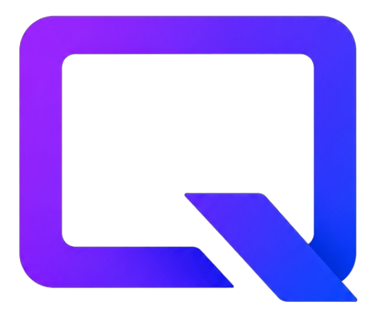

# Qiosk

<p align="center">
  
</p>

Navegador travado em tela cheia para totens, mostruarios e quiosques touch.
Abre uma URL (site, app web, HTML local) e bloqueia tudo - saida so com
toques secretos em um canto da tela ou atalho de emergencia + senha.

## Features

- **Tela cheia travada** — sem bordas, sem menu de contexto, atalhos comuns bloqueados
- **Auto-recovery** — se o navegador crashar, reinicia sozinho
- **Modo offline** — tela amigavel "tentando reconectar" + retry automatico a cada 10s
- **Idle return** — volta pra URL inicial depois de N minutos sem toque (configuravel)
- **Esconder cursor** — depois de 3s parado, some (touch fica limpo)
- **Saida protegida** — toques no canto secreto + teclado numerico touch + senha SHA-256
- **Failsafe** — `Ctrl+Alt+Shift+Q` sempre abre o campo de senha
- **Instancia unica** — mutex Win32 impede dois Qiosk rodando juntos
- **Tema escuro** nativo (incluindo a title bar do Windows)
- **Log rotativo** — `qiosk.log` ao lado do exe, max ~4MB

## Como usar

### Opcao A: Compilar do codigo (recomendado para devs)

Precisa de **Python 3.10+** instalado e acessivel no PATH.

```powershell
git clone https://github.com/lucas-fro/qiosk.git
cd qiosk
.\build.ps1
```

O `build.ps1` faz tudo:

1. Instala dependencias (`PyQt5`, `PyQtWebEngine`, `PyInstaller`)
2. Compila `Qiosk.exe` em `dist\Qiosk\` (usando o `qiosk.ico` ja versionado)
3. Cria atalho **"Qiosk"** na area de trabalho

Da um duplo-clique no atalho da area de trabalho e voce abre o editor de
configuracao. Configura URL, senha, etc, depois clica em **"Salvar e iniciar Qiosk"**.

Flags do `build.ps1`:

| Flag | O que faz |
|---|---|
| `.\build.ps1` | Build completo + atalho (default) |
| `.\build.ps1 -SkipDeps` | Pula `pip install` (build mais rapido em iteracoes) |
| `.\build.ps1 -NoShortcut` | So compila, nao mexe no desktop |

### Opcao B: Baixar release pronto (em breve)

Vai ter zip pre-buildado na aba **Releases** do GitHub. Baixa, extrai,
roda o `install.bat` que cria o atalho.

## Configuracao

Tudo pelo editor visual (atalho **Qiosk**):

| Campo | O que faz |
|---|---|
| URL inicial | Site/app que o totem abre |
| Senha para destravar | SHA-256, nao guarda em texto |
| Toques no canto | Quantos cliques para abrir o painel de senha |
| Janela de tempo | Em quantos segundos esses toques precisam acontecer |
| Canto secreto | Em qual canto da tela (4 opcoes) |
| Tamanho da area | Tamanho do "alvo" invisivel |
| Voltar para home apos | Idle timeout (0 = desativado) |
| Esconder cursor apos | Auto-hide cursor (0 = sempre visivel) |
| Sempre na frente | Mantem o kiosk acima de outras janelas |
| Mostrar marca no canto | Marca vermelha translucida (desativar em producao) |

O config fica em `config.json` ao lado do `.exe`. Pode editar a mao se quiser.

## Saindo do kiosk

Tres formas, em ordem de uso:

1. **Toques no canto** — 5 toques rapidos no canto secreto (top-left default)
   → abre keypad → digita a senha
2. **Atalho de emergencia** — `Ctrl + Alt + Shift + Q`
   → abre keypad → digita a senha
3. **Forca bruta** — `Ctrl+Alt+Del` → Gerenciador de Tarefas → finalizar `Qiosk.exe`

A senha padrao e' **`123456`**. Troque na primeira execucao.

## Linha de comando

```powershell
Qiosk.exe                  # modo kiosk (usa config.json)
Qiosk.exe --config         # abre o editor
Qiosk.exe https://meusite  # kiosk com URL especifica (ignora config)
```

## Autostart no Windows

Pra o totem reiniciar e voltar pro kiosk sozinho:

1. `Win + R` → digite `shell:startup` → Enter
2. Cria um atalho do `Qiosk.exe` ai dentro (clica direito → Novo → Atalho)
3. **Importante:** NAO passa `--config` (queremos o modo kiosk direto)

## Requisitos

- **Windows 10 1809+ ou Windows 11** (para title bar escura e mutex)
- **Python 3.10+** so para compilar (usuario final nao precisa)
- ~500MB de disco livre durante o build (resultado final: ~265MB)

Funciona em Linux tambem (sem title bar escura nativa e sem mutex Win32),
mas o foco do projeto e' Windows. Para Android, use [Fully Kiosk Browser](https://www.fully-kiosk.com).

## Arquitetura

Single-file `qiosk.py` (~1000 linhas), PyQt5 + QtWebEngine (Chromium embutido).
Detalhes em [qiosk.py](qiosk.py).

## Licenca

Ver [LICENSE](LICENSE) (se ainda nao tem, escolha uma: MIT e' o padrao para
projetos open source pequenos).

---

Desenvolvido por **Lucas F**.
